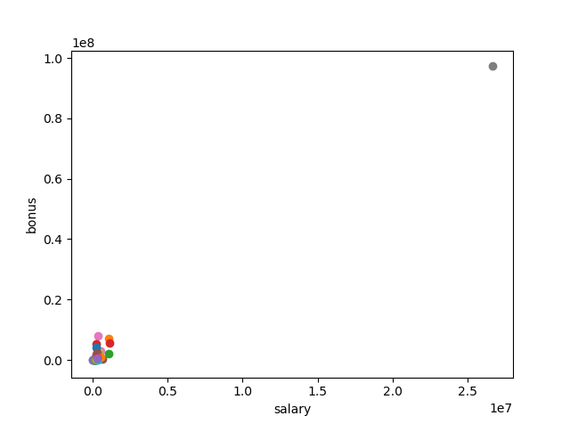

# P5: Identify Fraud from Enron Email
## Udacity Data Analyst Nanodegree
**By Jocelyn Moreau**

### Log change from submit #1:
 - I cleaned up the files to have only the one required for this project
 - class allocation between POI/non POI now stated in the report as well
 - impact of the engineered feature salary_bonus_ratio: I added the kbest score in the table of the 6 selected features and a assessment of the new feature under this table.
 - score of the features should come from k-best and not dtc: there was a mistake in my code, a missing "|{}|" thus the scores of the k-best feature selection were not printed. Now corrected.  I can't see any mistake in the formatting of the table (which appears correctly in my Atom IDE).

### Summarize for us the goal of this project and how machine learning is useful in trying to accomplish it. As part of your answer, give some background on the dataset and how it can be used to answer the project question. Were there any outliers in the data when you got it, and how did you handle those?  [relevant rubric items: “data exploration”, “outlier investigation”]

The goals of this project is to create a Person Of Interest identifier, using machine learning techniques. The ML is useful as the amount of data available is huge, and no one can possibly go through each document and be able to find features leading to the detection of a POI (unless this person has decades and an army of co-workers to process the data). Moreover, Machine Learning is able to find patterns in the data which could not be found by human being.

About the background of the dataset: In 2000, Enron was one of the largest companies in the United States. By 2002, it had collapsed into bankruptcy due to widespread corporate fraud. In the resulting Federal investigation, a significant amount of typically confidential information entered into the public record, including tens of thousands of emails and detailed financial data for top executives.
This dataset is publicly available and contains a lots of information that can be used to create, train and test our POI identifier.

#### Data exploration

The dataset contains 146 records. The features in the data fall into three major types, namely financial features, email features and POI labels.

#### POI / non POI allocation
The dataset has the following POI / non POI class allocation:
Number of POI: 18
Number of non POI: 128
Total : 146

#### Features

##### financial
- salary
- deferral_payments
- total_payments
- loan_advances
- bonus
- restricted_stock_deferred
- deferred_income
- total_stock_value
- expenses
- exercised_stock_options
- other
- long_term_incentive
- restricted_stock
- director_fees

##### email
- to_messages
- email_address
- from_poi_to_this_person
- from_messages
- from_this_person_to_poi
- shared_receipt_with_poi

There is one (1) other feature, which is a boolean, indicating whether or not the employee is a person of interest.

- poi

#### Missing Features

All features have have missing values (represented as "NaN"), except for the "poi" feature.

The missing values are as follow:

Legend:
- Count: total of record missing a value
-	POI: total of POI having avalue for this feature
-	percentage_total_missing: percentage of the value missing (in total 146 records)

|		features		|count|		poi		|percentage_total_missing|
|------|------|----------:|---------------------:|
|bonus			 	|64|		2|		0.438356|
|deferral_payments		|107		|13		|0.732877|
|deferred_income|97|7|0.664384|
|director_fees|129|18|0.883562|
|email_address|35|0|0.239726|
|exercised_stock_options|44|6|0.301370|
|expenses|51|0|0.349315|
|from_messages|60|4|0.410959|
|from_poi_to_this_person|60|4|0.410959|
|from_this_person_to_poi|60|4|0.410959|
|loan_advances|142|17|0.972603|
|long_term_incentive|80|6|0.547945|
|other|53|0|0.363014|
|poi|0|0|0.000000|
|restricted_stock|36|1|0.246575|
|restricted_stock_deferred|128|18|0.876712|
|salary|51|1|0.349315|
|shared_receipt_with_poi|60|4|0.410959|
|to_messages|60|4|0.410959|
|total_payments|21|0|0.143836|
|total_stock_value|20|0|0.136986|

Looking at the missing values in the document named “enron61702insiderpay.pdf”, all of them have the value “-“, which means 0 in this case. We will have to take care of this later on.

#### Outliers
Let’s visualize the date Salary / Bonus as in lessons 8:

The firstclear outlier to be removed is the line total. Let’s remove it and visualize the data again.

So much better now. Going visually through the file “enron61702insiderpay.pdf”, one more data has to be removed: THE TRAVEL AGENCY IN THE PARK.

### What features did you end up using in your POI identifier, and what selection process did you use to pick them? Did you have to do any scaling? Why or why not? As part of the assignment, you should attempt to engineer your own feature that does not come ready-made in the dataset -- explain what feature you tried to make, and the rationale behind it. (You do not necessarily have to use it in the final analysis, only engineer and test it.) In your feature selection step, if you used an algorithm like a decision tree, please also give the feature importances of the features that you use, and if you used an automated feature selection function like SelectKBest, please report the feature scores and reasons for your choice of parameter values.  [relevant rubric items: “create new features”, “intelligently select features”, “properly scale features”]

#### New Features

salary_bonus_ratio:

I decided to engineer the feature salary / bonus. This new feature could indicate if the person has a big difference between the two, which could indicate that he is involved in the scandal.

#### Intelligently select features

To select the most relevant features, I used the select k-best model, in a pipeline with grid search CV to select the features as shown in Katie's blog.

The first step, Select k-best, removes all but the k highest scoring features. The k features were then passed to a K-near Neighbors Classifier, with the 'f1' scoring estimator, intending to maximize precision and recall.
Here is the list of features, automatically selected by K-Best and their scores with the knc classifier:

##### KNC classifier
Best parameters are:  
- feature_selection__k: 6 (for k-best)
- dtc__max_depth: 2 (for dtc)
- dtc__criterion: entropy
- dtc__min_samples_split: 25
- dtc__splitter': random
- dtc__class_weight: balanced
- dtc__random_state: 42

The  classifier selected the 6 first features out of 9:

| # | Name | score kbest|
|--|--|--|
|1|bonus|30.729|
|2|salary|15.85|
|3|exercised_stock_options|9.68|
|4|total_payments|8.959|
|5|deferred_income|8.792|
|6|restricted_stock|8.058|
|7|loan_advances|7.038|
|8|deferral_payments|0.010|
|9|salary_bonus_ratio|0.007|

##### Importance of the new features

We can see above that our engineered feature  salary_bonus_ratio has little weight in the kbest scoring. What I thought was a good idea, was not so great. Trying the various classifier and comparing their performance with and without the new feature did not show any significant difference.

#### Scaling

I used scaling only when I used the k-nearest neighbours algorithm and the support vector machines (SVM) algorithm, but not when I used a decision tree.

As explained during the lessons, normalization is required for:

- k-nearest neighbours because we measure the distance between pairs of data, so the scale drives the clustering that determines the nearest neighbours. If one feature has a much larger scale than another, the clustering will be driven by the larger scale and the distance between points on the smaller scale will be valued less important.
- SVM because the distance between the separating plane and the support vectors drives the algorithm's decision-making. If one feature has a much larger scale than another, it will dominate the other features.

Scaling isn't required for tree-based algorithms because the splitting of the data is based on a threshold value. This decision made based on this threshold value is not affected by different scales.

### What algorithm did you end up using? What other one(s) did you try? How did model performance differ between algorithms?  [relevant rubric item: “pick an algorithm”]

Using the pipeline described above, I tested three algorithms with different values for parameter of each classifier.

- decision tree classifier
- Random Forest Classifier
- k-nearest neighbors Classifier

Here are the results for each classifier:

#### Decision Tree Classifier
Classification report:

                    precision   recall  f1-score   support

      0.0           0.96        0.61      0.74        38
      1.0           0.21        0.80      0.33         5
      avg / total   0.87        0.63      0.69        43

#### Random Forest Classifier
                    precision    recall  f1-score   support

      0.0             0.90      0.97      0.93        36
      1.0             0.00      0.00      0.00         4
      avg / total     0.81      0.88      0.84        40

#### k-nearest neighbors Classifier

                      precision    recall  f1-score   support

          0.0         0.92        0.89      0.91        38
          1.0         0.33        0.40      0.36         5
    avg / total       0.85        0.84      0.84        43

#### Cross check with the tester.px script:

                          DTC       RFC       KNC
      Accuracy            0.69847   0.85893   0.83033
      Precision           0.22474   0.51129   0.35498  
      Recall              0.51500   0.28300   0.33350
      F1                  0.31293   0.36434   0.34390
      Total predictions   15000     14000     15000
      True positives      1030       566       667
      False positives     3553      541       1212
      False negatives     970      1434      1333
      True negatives:     9447     11459     11788

Looking at the figures, we can see that the KNC classifier fulfill the requirement of the tester.py script (Precision and recall > 0.3), so that is the one I choose.

#### Classifier selected --> k-nearest neighbors Classifier

### What does it mean to tune the parameters of an algorithm, and what can happen if you don’t do this well?  How did you tune the parameters of your particular algorithm? (Some algorithms do not have parameters that you need to tune -- if this is the case for the one you picked, identify and briefly explain how you would have done it for the model that was not your final choice or a different model that does utilize parameter tuning, e.g. a decision tree classifier).  [relevant rubric item: “tune the algorithm”]

Tuning the parameters of an algorithm means adjusting the parameters to obtain the best performance of the algorithm. This can be done manually, by trying randomly and successivly tuning down the paramters and looking at the results, or automatically with GridSearchCV and the classification_report function.
If you don't tune well the algorithm, the performance is poor and the predictions of the algorithm are then poor as well.

For tuning my classifier, I used GridSearchCV. i took the example of Katie Malone's [blog](https://civisanalytics.com/blog/data-science/2016/01/06/workflows-python-using-pipeline-gridsearchcv-for-compact-code/). GridSearchCV allows us to construct a grid of all the combinations of parameters, tries each combination, and then reports back the best combination/model.

For my chosen knc classifier, I fed GridSearchCV with different parameter values (the optimal ones are highlighted in bold below). I used Stratified Shuffle Split cross validation to guard against bias introduced by the potential underrepresentation of classes (i.e. POIs).

  - knc__n_neighbors=[1, 2, 3, 4, **5**,6,7],
  - knc__leaf_size=[**1**, 10, 30, 60],
  - knc__algorithm=['**auto**', 'ball_tree', 'kd_tree', 'brute'],

### What is validation, and what’s a classic mistake you can make if you do it wrong? How did you validate your analysis?  [relevant rubric item: “validation strategy”]

Validation is the check used to ensure that a trained model is predicting correctly. This can be done by splitting the dataset we have into 2 separate datasets: one for training, one for testing. This way we can test the trained model on an independent testing set. The classical mistake is to take a too big training set, leading to overfitting the model, and a too small testing set (we could even not include the case we are looking for).

To perform this validation, I used the function “train_test_split”, coupled with the tester.py provided. As the dataset is small, the stratified shuffe split cross validation (used in tester.py) allows to perform and validate the accuracy of the model on a lot of different split training/test dataset. This way we ensure that the training and test set contain the same ratio of POI as in the whole dataset.

### Give at least 2 evaluation metrics and your average performance for each of them.  Explain an interpretation of your metrics that says something human-understandable about your algorithm’s performance. [relevant rubric item: “usage of evaluation metrics”]

To evaluate the performance of my classifier, I used the precision and recall metrics. Their values are as follow:

                          KNC  
      Precision           0.355  
      Recall              0.333

The precision and the recall being defined as follow:

- Precision is the percentage rate how often our class prediction is right when we guess that class
- Recall is how often we guess the class (POI vs. non-POI) when the class actually occurred
For our exercise here, we should concentrate on a higher recall rate, as it is better to identify non POI as POI than miss POI by declaring them as non POI. This is why I chose the classifier with the higher recall rate.

### References:
- https://chrisalbon.com/machine_learning/trees_and_forests/random_forest_classifier_example/
- http://scikit-learn.org/
- https://en.wikipedia.org/wiki/Precision_and_recall
- http://scikit-learn.org/stable/modules/pipeline.html
- https://www.civisanalytics.com/blog/workflows-in-python-using-pipeline-and-gridsearchcv-for-more-compact-and-comprehensive-code/
